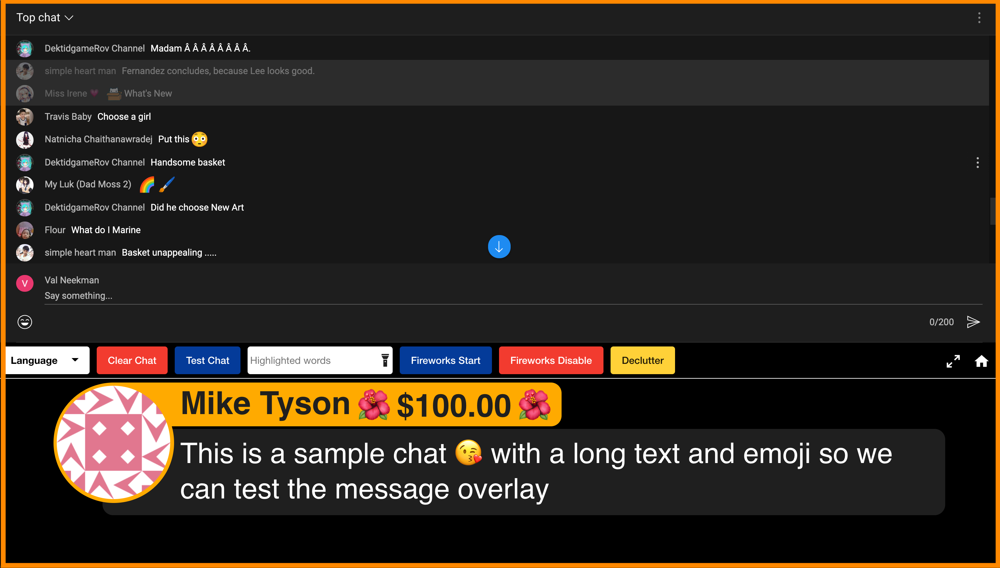
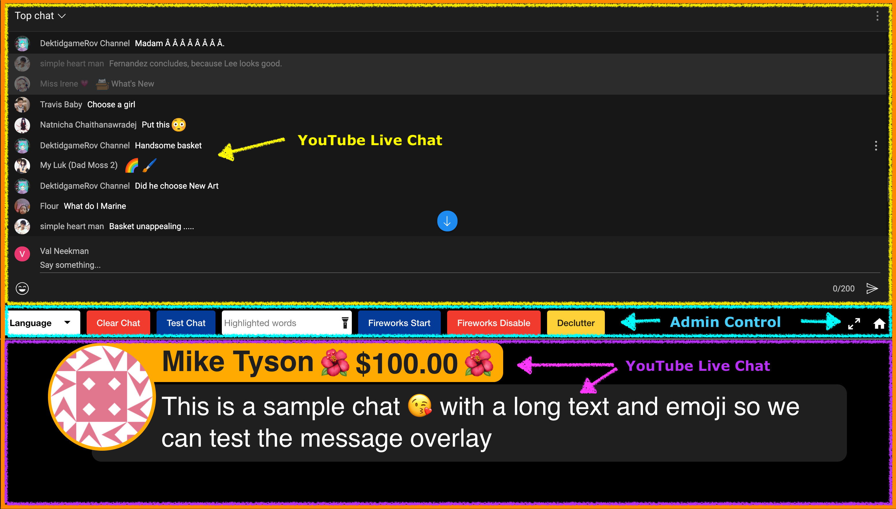
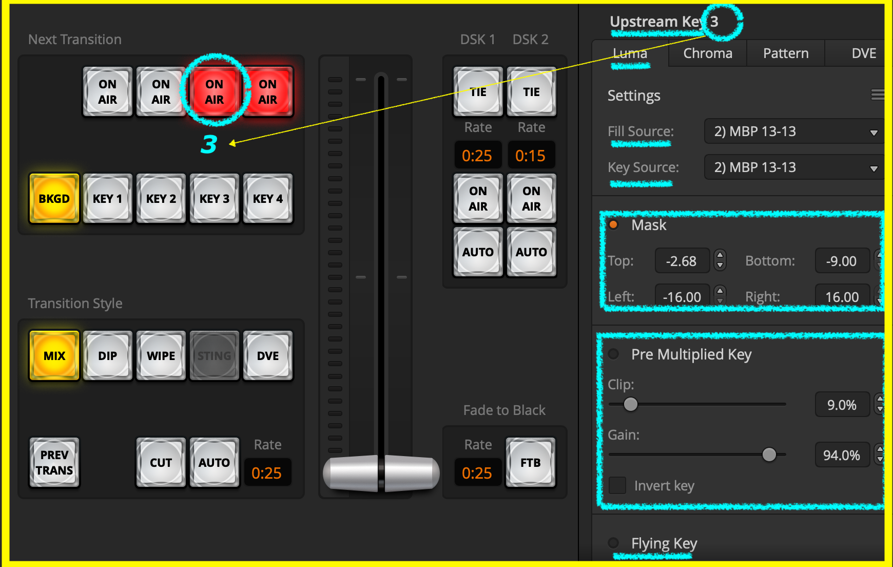

# AvidCaster Chat Overlay

Avidcaster Chat Overlay - Chrome Extension

## `Description`

Chrome Extension that enables [Avidcaster](https://avidcaster.net/chat/overview) to providing a low-cost lower-third video chat overlay.

## `Overview`

### `Viewer - Chat Overlay (seen by live stream viewers)`

The following image is what the end user sees on a their Live Video stream with chat overlay.

### `Admin - Chat Overlay (controlled by live stream owner / admin)`

The following image is the control panel used by the admin/owner of the Live Video stream.

# `Features`

### `Admin - Chat Overlay Controller`

The following image is the control panel and its details

### `Admin Features`

- Language (i18n, i10n)
  - Multiple language support
  - Left to Right, Right to Left Support
- Chat
  - Test Chat
  - Clear Chat
  - Highlighted words (highlights a chat border if contains words)
    - words with space in between (eg: "question qa qa:")
  - Superchat support
- Fireworks
  - Start
    - Automatic
      - Superchat triggered
    - Manual
      - Birthday
      - Best question
      - New members
  - Stop
    - Automatic
      - On next chat insert
    - Manual
      - At any time, admin driver
  - Enable / Disable
    - Prevents auto start of fireworks on superchat, etc
- Declutter / Reclutter
  - Declutter to clean up the chat window to quickly find chat items
  - Reclutter to put everything back to interact with YouTube chat
- Fullscreen
  - Toggle fullscreen
    - On - ready to be cropped with `mask` feature of video switcher such as ATEM or OBS etc.
    - Off - ready to move the browser window around
- Home
  - Takes you back to [Avidcaster](https://avidcaster.net) main page

# `Admin - Video Switcher Settings`

### `ATEM Mini Setup`

The following image is the ATEM Software Control, depicting, the downstream luma key setup. Tweak the mask based on your needs.

#### `ATEM Details`

- Upstream Key

  - Luma
  - Fill & Key (source)
    - The computer running chrome
  - Mask
    - Ensure the chrome tab containing the cast is in fullscreen
    - Tweak values to position your chat while cutting the top portion
  - Clip / Gain
    - Tweak to get best result

- Downstream Key
  - Similar to Luma, but Downstream is OnAir
  - Tweak `mask` for proper positioning

### `OBS Setup` (TBD)

## Privacy Policy

This extension will not store any user information, it simply enables chat overlay on YouTube streams.

## `Credits`

This extension was inspired by prior art by:

- [ROJ BTS](https://www.youtube.com/watch?v=NHy9D4ClTvc)
- [A. Parecki](https://youtu.be/HwctGtdsHZI)
